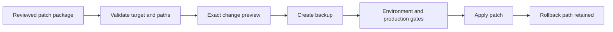

# AI Patch Runner

> **Supporting engineering project · WordPress/PHP · guarded plugin patching · preview · backup · rollback**

**Developer profile:** [Andrew Baeten](https://github.com/Yolol100) · [Portfolio cases](https://andrewbaeten.nl/category/cases)

AI Patch Runner is an admin-only WordPress plugin for reviewing structured patch packages before they change an installed plugin. It is designed around controlled inspection, exact previews, backups and rollback rather than blind file replacement.

## What it demonstrates

| Area | Implementation |
| --- | --- |
| Patch workflow | Import a reviewed JSON patch package, inspect the target and preview exact file changes |
| Safety | Capability checks, multisite restrictions, path validation and bounded patch storage |
| Production guard | Production applies are disabled unless both a trusted server-side constant and the UI setting allow them |
| Recovery | Backups and rollback remain part of the patch workflow |
| Packaging | Dependency-free runtime package with WordPress-native APIs |
| Maintenance | Explicit versioning, changelog and WordPress.org-style metadata |

## Workflow



1. Inspect the target plugin.
2. Import a reviewed patch package.
3. Preview the proposed file changes.
4. Confirm the target and environment.
5. Apply only after the safety gates pass.
6. Keep the generated backup available for rollback.

An example package is available in [`examples/patch-template.json`](examples/patch-template.json).

## Production safety

Patch applying is blocked on production by default. Production writes require both:

1. `AIPR_ALLOW_PRODUCTION_APPLY` set to `true` in trusted server-side configuration.
2. The production-apply setting enabled in the WordPress admin UI.

For normal use, keep production applying disabled, validate changes on staging first and retain a rollback path.

## Requirements

- WordPress 6.4+
- PHP 8.0+
- A user with plugin-update privileges
- Multisite: super-admin access for patch-management actions

Current plugin version: **3.1.7**. See [`readme.txt`](readme.txt) and [`CHANGELOG.md`](CHANGELOG.md) for release details.

## Repository structure

```text
ai-patch-runner.php       Plugin bootstrap
includes/                 Admin and runtime implementation
examples/                 Example structured patch package
assets/                   Admin assets
readme.txt                WordPress plugin metadata
CHANGELOG.md              Release history
uninstall.php             Controlled cleanup
```

## Portfolio context

This repository focuses on guarded maintenance tooling rather than a client-facing feature. It complements the larger WordPress portfolio by showing defensive file operations, environment gates and rollback-oriented engineering.

## License

GPL-2.0-or-later.
